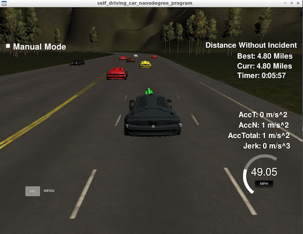

# **Path Generate Model Documenation** 

## Surrounding Cars Sensing

At the beginning of each iteration of the path planning, a function checkNeighbors is run with the current status of the car and sensor fusion data. The following distance and speed data will be extracted in the checkNeighbors function.

- The car infront of us
- The car in front of us in the left lane
- The car behind us in the left lane
- The car in front of us in the right lane
- The car behind us in the right lane

This information will be passed to the state transition function to determine the next step for our car.

## Finite State Machine

A finite state machine with two states is used for planning. The first state is keep lane, the second state is change lane. The pseudo-codes for state transition is shown as follows.

```
if(keep lane)
{
    if(too close to front car and speed smaller than speed limit)
    {
        if(current not on left lane and left lane clear)
        {
            go to change lane state with target left lane;
        }

        if(current not on right lane and right lane clear)
        {
            go to change lane state with target right lane;
        }
    }
    else
    {
        continue keep lane;
    }
}

if(change lane)
{
    if(change lane not finished)
    {
        continue change lane;
    }
    else
    {
        go to keep lane;
    }
}
```

## Path Generation

The path generating is similar to the spline method described in the Q&A section. The speed change is integrated into the new point generation. And the acceleration and deceleration part is adjusted to be more state.

## Result
The car is able to drive at top speed, change lane, without violating rules for more 4.5 miles.


